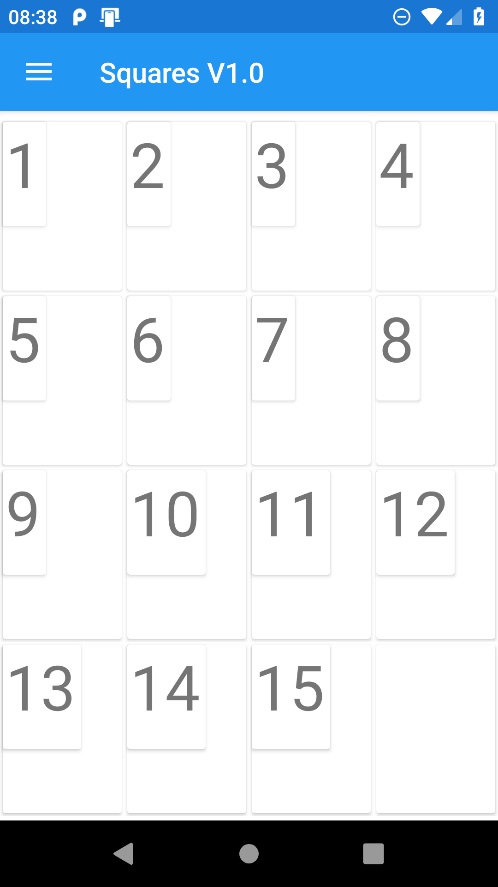
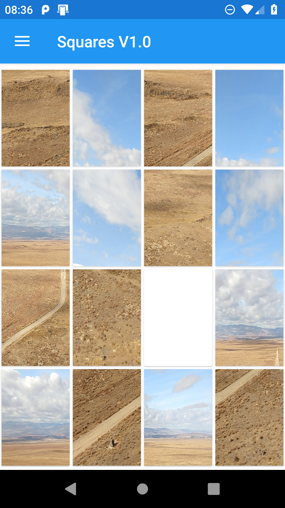
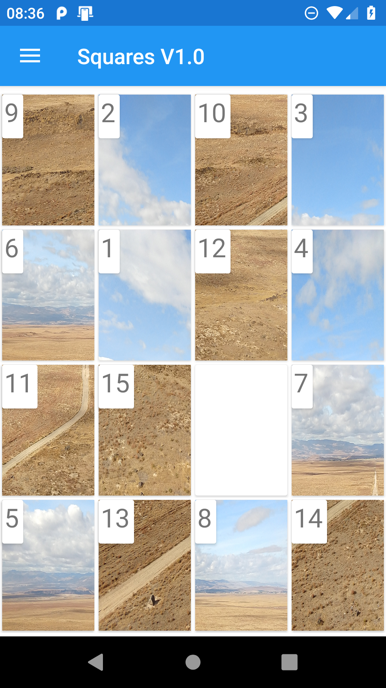
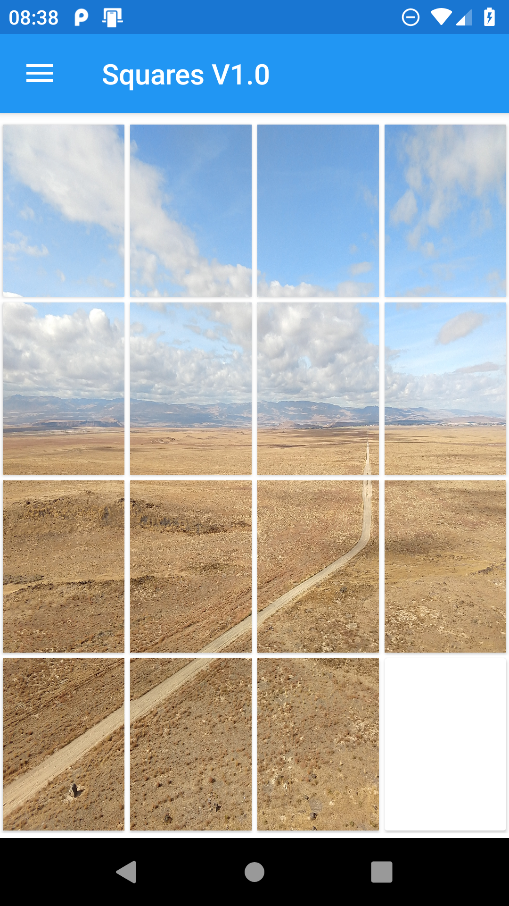
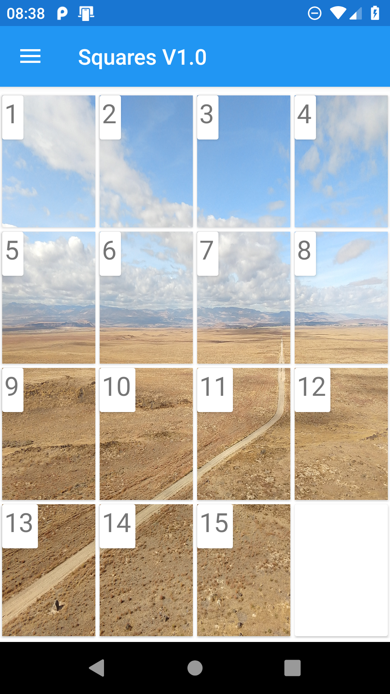
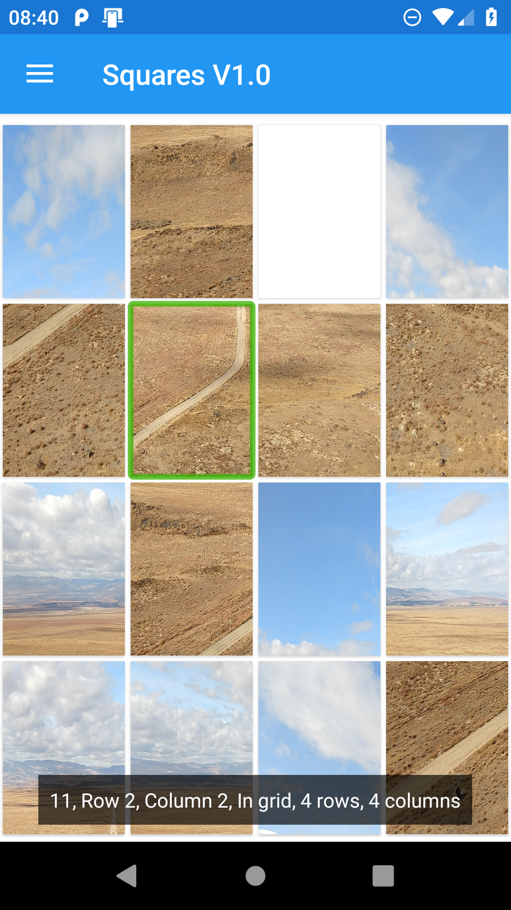
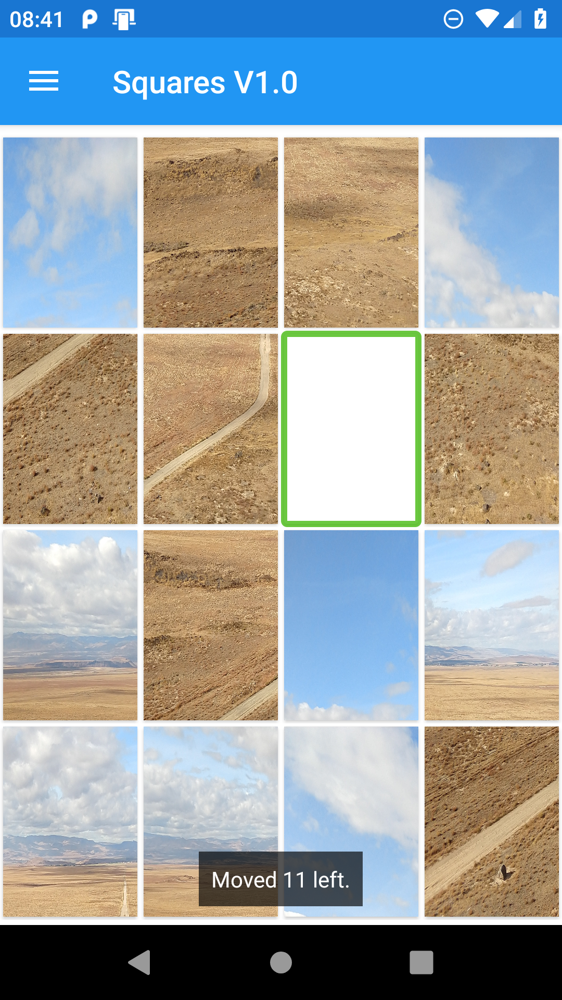

# MobileGridGames

***Please note that this ReadMe is a little stale. I'll update it as time permits.***

A LinkedIn article relating to this app is up at [Considerations on building accessible puzzle games for Android](https://www.linkedin.com/pulse/considerations-building-accessible-puzzle-games-android-guy-barker).

**Goals**

The goals of this app are: (1) to demonstrate some accessibility considerations and implementation relating to a simple Xamarin game app, and (2) make an enjoyable game available for everyone.

This exploration into accessibility is a continuation of the exploration started with [How a Card Matching game is compliant with international accessibility standards](https://www.linkedin.com/pulse/how-card-matching-game-compliant-international-standards-guy-barker).

&nbsp;

**Download the Game**

The game can be downloaded for Android devices, at [Grid Game at the Google Play Store](https://play.google.com/store/apps/details?id=com.guybarker.mobilegridgames).

Some videos of the game are at:

1. [Android Grid Game V1.2 is ready to play!](https://youtu.be/uKYY5onc7BA)

2. [Android Grid Game V1.2 being played with TalkBack.](https://youtu.be/TRv9GON31IE)

3. [Android Grid Game V1.2 being played with Voice Access.](https://youtu.be/GDxu6h-_g_U)

&nbsp;

**Playing the Game**

The game is based on a square sliding game, where squares in a grid of squares are rearranged by the player to form an ordered sequence in the grid.

When the game is run, a 4x4 grid of squares appears, with 15 of those squares occupied with an movable element, and 1 square being empty. When a square is tapped, if it is adjacent to the empty square, the tapped square moves into the empty square. The space where the tapped square was then becomes the empty square. The aim is to arrange all the squares in a sorted order, leaving the empty square in the bottom right corner of the grid.

***Tip: Don't use a swipe gesture to move a square. Support for swipe gestures has yet to be added to the game.***

***Tip: Don't tap on the empty square. Instead tap on the squares next to the empty square.***

When the game first runs, the setting to have numbers shown on squares is on, and the settings to have pictures shown on the squares is off. This means a number is shown in the top left corner of the squares. When the squares are sorted, the square showing number 1 is at the top left of the grid, and the numbers increase from left to right then top to bottom. 

***Tip: Practice moving numbered squares around before changing the setting to have a picture shown on the squares.***

When the game setting to have a picture shown on the squares is on, then a single picture is shown across all the squares. The sections of the picture will appear jumbled until the squares are arranged in their sorted order.

The following image shows the game showing ordered squares in the grid, with a number between 1 and 15 shown on the squares.

&nbsp;

&nbsp;

The following image shows the game showing a picture jumbled across the squares in the grid.

&nbsp;

&nbsp;

The following image shows the game showing a picture jumbled across the squares in the grid, with a number between 1 and 15 also shown on the squares.

&nbsp;

&nbsp;

The following image shows the game showing a picture ordered across the squares in the grid.

&nbsp;

&nbsp;

The following image shows the game showing a picture ordered across the squares in the grid, with a number between 1 and 15 also shown on the squares.

&nbsp;

&nbsp;

**Ways to play the game**

***Tapping with a finger***: Tap the square to be moved.

***Make things bigger***: The game respects the system's [Font size and Display size](https://support.google.com/accessibility/android/answer/11183305) settings, and also has its own in-app text size setting which only applies to text in shown on the squares in the game.

***Voice Access***: Activate the system's [Voice Access](https://support.google.com/accessibility/android/answer/6151848), and speak the number shown on a square to move the square.

A video of the game being played with Voice Access is at [Android Grid Game V1.2 being played with Voice Access](https://youtu.be/GDxu6h-_g_U).

***Switch Access***: Activate the system's [Switch Access](https://support.google.com/accessibility/android/answer/6301490), scan to the square to be moved and then press the switch to move the square.

***Magnification***: The standard use of the system's [Magnification](https://support.google.com/accessibility/android/answer/6006949) can be used when playing this game.

***TalkBack***: Turn on [TalkBack](https://support.google.com/accessibility/android/answer/6007100), and move your finger around the screen to have the number of the square beneath your finger announced. If TalkBack moves between rows or columns in the grid of squares, it will announce the new row or column. Double tap to move a square. TalkBack will make the following announcements following specific actions being taken in the game.

1. "Please wait a moment while the pictures are loaded into the squares."

2. ***A countdown as the pictures are loaded into the squares.***

3. "Game is ready to play."

4. "Moved ***Square number*** ***Direction of move***."

5. "A move is not possible from here."

&nbsp;

Please note that during development of the app, TalkBack's announcements were not always consistent. For example, sometimes the row and column of a square was not announced when moving to a square, even with TalkBack's "Speak list and grid information" setting turned on. Also, after double-tapping on a square to move it, once TalkBack made the expected announcement, it then announced that a move of the empty square is not possible. If these issues are experienced by anyone using TalkBack after the game has been downloaded from the Google Play Store, I'll investigate further.

Also note that the accessible name of the Menu button near the top left corner of the app currently has a name of "OK". This will be changed to have a name of "Menu" at some point.

A video of the game being played with TalkBack is at [Android Grid Game V1.2 being played with TalkBack](https://youtu.be/TRv9GON31IE).

&nbsp;

The following image shows the game with a jumbled picture on the squares, and TalkBack speech of "11, Row 2, Column 2, In grid, 4 rows, 4 columns".

&nbsp;

&nbsp;

The following image shows the game with a jumbled picture on the squares, and TalkBack speech of "Moved 11 left."

&nbsp;

&nbsp;

**Technical Considerations**

***Note for devs***

This app was based on an Visual Studio template for MVVM Xamarin apps. The app is now however definitely not an MVVM app, and does not show best practices at all for building Xamarin apps. It exists at the moment only to explore a variety if interaction methods when playing this specific game. Depending on whether the game generates any interest, the code might be updated to have a better MVVM design, but until then, devs should only consider looking at this code if they're interested in specific accessibility-related topics.

***Grid Control***: An early consideration when building this app was which Xamarin control would be the best match for the grid of squares. While the [WinForms version](https://github.com/gbarkerz/WinFormsMatchingGame/tree/master/WinFormsSquaresGame) of this game uses a DataGridView, the best match for this Xamarin app seemed to be the [CollectionView](https://docs.microsoft.com/xamarin/xamarin-forms/user-interface/collectionview) control. It seemed relatively straightforward to present a 4x4 grid of items in the CollectionView, and resize the items to fill the screen regardless of screen size or orientation. If also seemed practical to resize the contents of the items to fill whatever portion of the item is required.

***Reacting to input***: When development on the app began, it was assumed that the first version of the app would support keyboard use. The simplest way to support keyboard use seemed to be through responding to a change of [Selection](https://docs.microsoft.com/xamarin/xamarin-forms/user-interface/collectionview/selection) in the CollectionView. So this approach was taken to support both keyboard use and touch use, despite the suggestion at [Handling Item Taps](https://devblogs.microsoft.com/xamarin/5-quick-tips-for-collectionview/#handling-item-taps) that a tap gesture might be more straightforward way to support touch input. However, testing indicated that tap gesture support would be required to support Voice Access, and as such the SelectionChanged approach was replaced with the tap gesture approach. However, testing then indicated that the SelectionChanged support would be required to support Switch Access. The end result is that the app reacts to both SelectionChanged and tap gestures.

***Showing portions of the picture on each square***: The first attempt at showing portions of a picture on each square was achieved by scaling the entire picture into each square, and then applying an X and Y translation such that only the appropriate portion of the image was shown in the square. Technically this worked, but the performance of the app was unusably slow. 

So the approach changed to have only the specific portion of the overall image set as the image on each square. This involved generating 15 cropped images from the original image. I'm not aware of a native Xamarin image editor which can do this, so I used the [SyncFusion Image Editor](https://help.syncfusion.com/xamarin/image-editor/overview). Through a series of calls to the SfImageEditor's ToggleCrop(), Crop(), Save(), and Reset(), the appropriate portions of the original image were set on the squares, leaving the original image file unaffected. It seems that some of the calls need to be run on the UI thread, and I really don't understand the SfImageEditor's threading model, but the desired result seemed to be achieved. I expect this code will be updated once I learn more about best practices for the SfImageEditor.

Note: My use of the SfImageEditor control is covered by the [Syncfusion Community Licence](https://www.syncfusion.com/products/communitylicense). If you were to consider using the control, you'd use whatever licence is appropriate for you and add your own licence key to the code.

***Size of Text***: As part of this exploration into accessibility, there is no hard-coded sizing of text or containers anywhere in the code. This is very deliberate, in order to reduce the risk of text being clipped when some UI scaling is applied. The height of text shown in the grid squares is relative to the height of the grid row containing the square. The height of text shown in the Settings window is set by the system, and the window uses a ScrollView to ensure all content can be reached when text is shown as its maximum size. As a result, all text is viewable in the game even when the game's in-app text size setting and the system's Font size and Display size settings are all at their maximum values.

***Use of Colour***: The app uses the same colours that came with the template used to create the app. At some point work may be done to support a Dark theme in the app.

***Use of Timers***: No timers are used in the app. If in the future timers are used, the timeout periods much be in full control of the player.

***TalkBack***: The Xamarin [AutomationProperties](https://docs.microsoft.com/xamarin/xamarin-forms/app-fundamentals/accessibility/automation-properties) class is used to set explicit accessible names to the squares. If the app ever ships in a non-English region, the accessible names must be localized. The app can support having accessible descriptions set on the squares too, and so this will be done if feedback suggests that that would be helpful to players. 

Android platform-specific code is used to raise events for TalkBack to react to following a variety of player actions.

Currently the Menu button created from the app template has an accessible name of "OK". A more appropriate name would be "Menu", but I've yet to find where that name is being set. At some point I will either change the name being set on it, or override it somehow.

&nbsp;

***Keyboard Use***: Today the game does not support keyboard use. If keyboard use is supported in the future, it will involve the CollectionView reacting to SelectionChanged events as a key is pressed when an item has keyboard focus. It will also require keyboard focus visual feedback to be much stronger than it is today on the squares. 

&nbsp;

**Accessibility issues highlighted by Google**

When submitting the app to the Google Play Store, Google examines the app to raise awareness of potential accessibility issues. Interestingly Google raised concerns around a number of aspects of the app which as far as I know relate to the accessibility of default Xamarin controls or the VS template from which the app was created.

The concerns seem to relate to the contentDescription of the picker in the Settings window, nine instances of text with low contrast, and two instances of small hit targets. For a future release I'll examine all of these concerns, and consider whether it would seem appropriate to override the default properties of some of the controls shown in the app.

&nbsp;

**Future Updates**

Future updates to the app may include the following:

1. Add support to the Pairs game for selecting custom images and accessible details.

2. Support a dark theme in the app.

3. Show instructions the first time a game is run.

4. Change the accessible name of the Menu button from "OK" to "Menu".

5. Add support for using Voice Access to click the Settings buttons in the games.

6. Support a swipe gesture to move the squares in the game. It's expected that this will require changes to prevent the CollectionView itself from managing swipe gestures made over the view.

7. Support keyboard use and stronger keyboard focus feedback.

8. Timeout an attempt to load a picture if it's taking too long.
